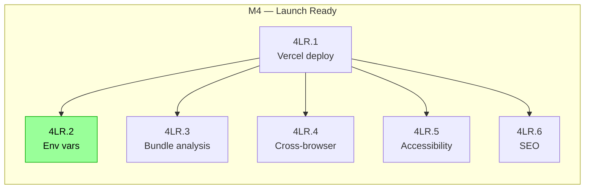

# Portfolio — MVP Roadmap

> This roadmap is a living document. Update it as scope clarifies.

## Goal

A polished, nature-themed developer portfolio that showcases work through smooth scroll animations and an immersive forest-inspired design. MVP delivers a complete portfolio experience with hero section, project showcase, skills display, and contact form.

---

## M1 — Foundation & Design System 

### In Progress 

### To Do 

### Blocked 

### Completed 

- [x] `1DS.1` Set up React Router v7 with TypeScript strict mode
- [x] `1DS.2` Configure Tailwind v4 with custom CSS variables (forest colour palette)
- [x] `1DS.3` Implement typography system (Inter + JetBrains Mono via `@theme`)
- [x] `1DS.4a` Create UI component structure (`Button`, `Card`, `Badge`, `SectionWrapper`)
- [x] `1DS.5` Set up Framer Motion with reduced motion support (`useReducedMotion`)
- [x] `1DS.4c` Create section components (`Hero`, `About`, `Projects`, `Skills`, `Contact`)
- [x] `1DS.4b` Create layout component (`Nav.tsx`) — Footer intentionally omitted; name in Nav scrolls to top

---

## M2 — Core Sections & Navigation 

### In Progress 

### To Do 

### Blocked 

### Completed 

- [x] `2NA.3` Scroll-driven background colour transitions (`useSectionBackground` + `BackdropAnimator`)
- [x] `2SC.1` Build Hero section — name, tagline, CTAs
- [x] `2SC.2` Create About section — short story, values, photo placeholder
- [x] `2SC.3` Implement Projects section — card grid using `Card` + `Badge`
- [x] `2SC.4` Add Skills section — tech stack display
- [x] `2SC.5` Build Contact section — form with Zod validation + Resend action stub
- [x] `2NA.2` Assemble home route — all sections, `BackdropAnimator`, `useSectionBackground`
- [x] `2NA.1` Create sticky Nav — transparent over Hero, scroll-driven background, active section dot indicator, GitHub icon

---

## M3 — Content & Polish 

### In Progress 

### To Do 

### Blocked 

### Completed 

- [x] `3CP.4` Add mobile hamburger navigation — expand `Nav.tsx` with full-screen overlay menu
- [x] `3CP.2` Populate real project and skills data in TypeScript content files
- [x] `3CP.5` Contact delivery — replaced form + Resend with mailto link and social links
- [x] `3CP.1` Project detail view — implemented as `ProjectModal` rather than separate route
- [x] `3CP.6` Asset optimisation — `width`/`height`/`loading` attrs on headshot; no other heavy assets
- [x] `3CP.3` Entrance animations verified — scroll transitions and section background colours confirmed

---

## M4 — Launch Ready 

### In Progress 

### To Do 

- [ ] `4LR.1` Vercel deployment configuration
- [ ] `4LR.2` Environment variables setup (`.env` — no Resend vars needed; add any future secrets here)
- [ ] `4LR.3` Performance optimisation and bundle analysis
- [ ] `4LR.4` Cross-browser testing
- [ ] `4LR.5` Accessibility audit (WCAG compliance)
- [ ] `4LR.6` SEO meta tags and social sharing

### Blocked 

### Completed 

---

## Out of Scope (for MVP)

- Blog/articles section
- Admin dashboard for content management
- Multi-language support
- Advanced analytics integration
- PWA features (offline, install)
- Advanced animations beyond scroll and entrance effects
- Third-party integrations beyond email
- A/B testing or personalisation features

---

## Progress Map 

