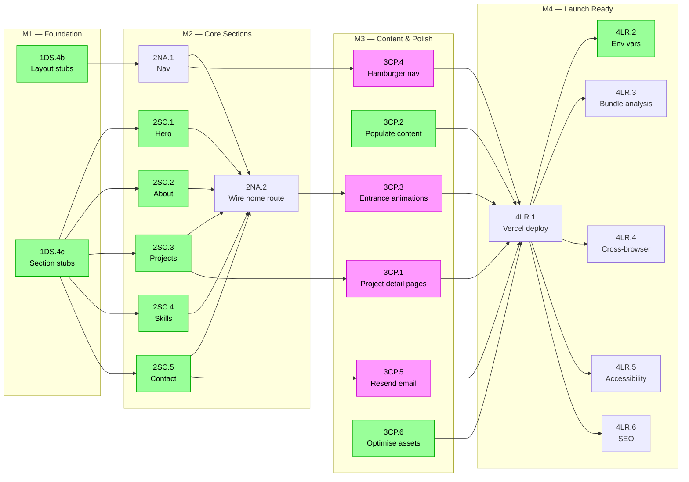

# Portfolio — MVP Roadmap

> This roadmap is a living document. Update it as scope clarifies.

## Goal

A polished, nature-themed developer portfolio that showcases work through smooth scroll animations and an immersive forest-inspired design. MVP delivers a complete portfolio experience with hero section, project showcase, skills display, and contact form.

---

## M1 — Foundation & Design System 

### In Progress 

### To Do 

- [ ] `1DS.4b` Create layout component stubs (`Nav.tsx`, `Footer.tsx`)
- [ ] `1DS.4c` Create section component stubs (`Hero.tsx`, `About.tsx`, `Projects.tsx`, `Skills.tsx`, `Contact.tsx`)

### Blocked 

### Completed 

- [x] `1DS.1` Set up React Router v7 with TypeScript strict mode
- [x] `1DS.2` Configure Tailwind v4 with custom CSS variables (forest colour palette)
- [x] `1DS.3` Implement typography system (Inter + JetBrains Mono via `@theme`)
- [x] `1DS.4a` Create UI component structure (`Button`, `Card`, `Badge`, `SectionWrapper`)
- [x] `1DS.5` Set up Framer Motion with reduced motion support (`useReducedMotion`)

---

## M2 — Core Sections & Navigation 

### In Progress 

### To Do 

- [ ] `2SC.1` Build Hero section — name, tagline, CTAs
- [ ] `2SC.2` Create About section — short story, values, photo placeholder
- [ ] `2SC.3` Implement Projects section — card grid using `Card` + `Badge`
- [ ] `2SC.4` Add Skills section — tech stack display
- [ ] `2SC.5` Build Contact section — form with Zod validation + Resend action
- [ ] `2NA.1` Create sticky Nav with scroll-driven background transition
- [ ] `2NA.2` Assemble home route — wire all sections, `BackdropAnimator`, `useSectionBackground`

### Blocked 

### Completed 

- [x] `2NA.3` Scroll-driven background colour transitions (`useSectionBackground` + `BackdropAnimator`)

---

## M3 — Content & Polish 

### In Progress 

### To Do 

- [ ] `3CP.2` Populate real project and skills data in TypeScript content files
- [ ] `3CP.6` Optimise images and assets

### Blocked 

- [ ] `3CP.1` Add project detail pages (`/projects/:slug`) — blocked on `2SC.3`
- [ ] `3CP.3` Verify entrance animations on all sections (via `SectionWrapper`) — blocked on M2 sections
- [ ] `3CP.4` Add mobile-responsive hamburger navigation — blocked on `2NA.1`
- [ ] `3CP.5` Configure contact form email delivery (Resend) — blocked on `2SC.5`

### Completed 

---

## M4 — Launch Ready 

### In Progress 

### To Do 

- [ ] `4LR.1` Vercel deployment configuration
- [ ] `4LR.2` Environment variables setup (`.env` — `RESEND_API_KEY`, `CONTACT_TO_EMAIL`)
- [ ] `4LR.3` Performance optimisation and bundle analysis
- [ ] `4LR.4` Cross-browser testing
- [ ] `4LR.5` Accessibility audit (WCAG compliance)
- [ ] `4LR.6` SEO meta tags and social sharing

### Blocked 

### Completed 

---

## Out of Scope (for MVP)

- Blog/articles section
- Admin dashboard for content management
- Multi-language support
- Advanced analytics integration
- PWA features (offline, install)
- Advanced animations beyond scroll and entrance effects
- Third-party integrations beyond email
- A/B testing or personalisation features

---

## Progress Map 

